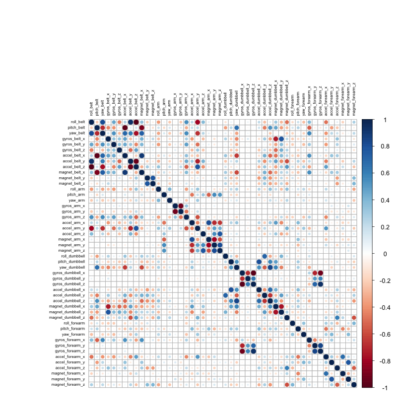
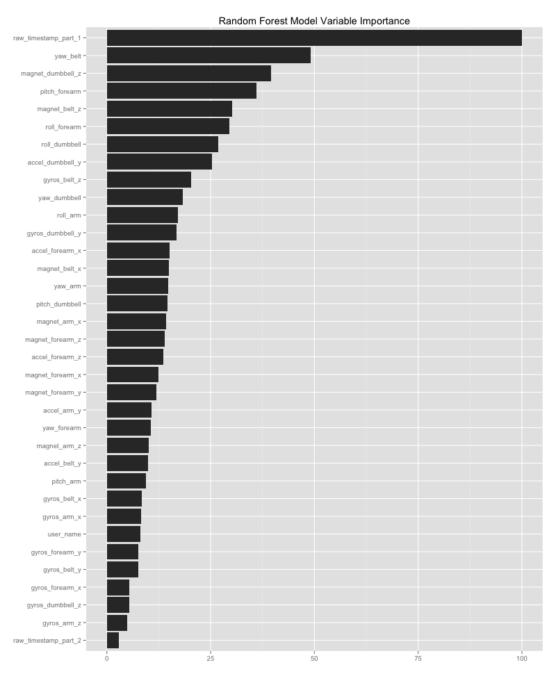

###Introduction

Human Activity Recognition (HAR) is a growing field of scientific investigation. As wearable technology penetrates consumer markets, interest in HAR is exploding. Early work in this field focused on correctly identifying activities performed using data gathered from wearable sensors. Advanced studies are building upon this foundation with investigation into "how well" certain activities are performed. Ability to correctly identify the activity performed and describe the quality of the performance using raw data obtained from wearable sensors has significant implications for HAR research. Sports training is one obvious practical application in this area.

Weight Lifting Exercise Dataset was used for this project. Six healthy volunteers were asked to perform one set of 10 repetitions of a unilateral dumbbell biceps curl. They performed the exercise with a varying degree of correctness, encompassing the most common mistakes people tend to make. The various ways of performing this exercise were categorized (A-E). During the exercise, volunteers were equiped with four accelerometer/gyroscope sensors: belt, arm, glove, and dumbbell. Euler angles (roll, pitch, yaw) as well as the raw accelerometer and gyroscope data are made avaiable in this dataset. The purpose of this project was to construct a machine learning algorithm to predict exercise quality using sensor data.

More information on this data can be found at:
http://groupware.les.inf.puc-rio.br/har

###Data Acquisition

Original data for this project was downloaded on 02-19-2015.

The training data are available at:
https://d396qusza40orc.cloudfront.net/predmachlearn/pml-training.csv

The test data are available at:
https://d396qusza40orc.cloudfront.net/predmachlearn/pml-testing.csv

The data were loaded into R software version 3.1.2 for analysis and prediction model construction.

###Data Cleaning
The original dataset downloaded from its source contained 160 variable, which included raw measurements as well as calculated variables derrived from the raw data. Furthermore, the dataset included "summary" rows that included calculated averages, standard deviations, etc. for a set of observations. Calculated variables as well as the summary rows were excluded, leaving only the raw data for prediction model construction.

Variables containing raw data were selected using a series of `grep()` functions. These variables were re-classified as numeric.
```
names <- names(train)
roll <- grep("^roll", names)
pitch <- grep("^pitch", names)
yaw <- grep("^yaw", names)
accel <- grep("^accel", names)
gyro <- grep("^gyro", names)
magnet <- grep("^magnet", names)
```
Rows containing summary statistics were identified and removed using `filter()` function from the `dplyr` package. This decreased the number of observations to 19216 from 19622. 
```
cleanTrain3 <- filter(cleanTrain2, new_window=="no")
```
Variables containing volunteer identification, and raw timestamp data were also included in the model. The abovementioned operations yielded a selection of 52 variables.

###Variable Selection
To further decrease the number of variables to include in the final prediction model, redundant variables were identified using a correlation matrix. Predictors that correlate with each other are considered redundant and removing such variables makes the final prediction model more efficient. To discover these redundant predictors, raw data variables were plotted against each other in a correlation matrix using `cor()` function. Variables with correlation > 0.75 were selected with `findCorrelation()` and removed from the final model. This method identified 16 redundant variables. 
```
> redundantVars
 [1] "accel_belt_z"      "roll_belt"         "accel_dumbbell_z"  "accel_belt_x"      "pitch_belt"       
 [6] "magnet_dumbbell_x" "magnet_dumbbell_y" "accel_arm_x"       "accel_dumbbell_x"  "magnet_arm_y"     
[11] "accel_arm_z"       "magnet_belt_y"     "accel_forearm_y"   "gyros_arm_y"       "gyros_forearm_z"  
[16] "gyros_dumbbell_x" 
```


###Prediction Model
I chose to use Random Forests to build our prediction model for this project due to this method's inherent accuracy, particularly when dealing with a large number of predictors. Abovementioned methods reduced the dimensions of the original data set. The training dataset to be used for model construction had 36 variables, compared to the 160 original variables. 
```
> names(cleanTrain4)
 [1] "user_name"            "raw_timestamp_part_1" "raw_timestamp_part_2" "yaw_belt"            
 [5] "gyros_belt_x"         "gyros_belt_y"         "gyros_belt_z"         "accel_belt_y"        
 [9] "magnet_belt_x"        "magnet_belt_z"        "roll_arm"             "pitch_arm"           
[13] "yaw_arm"              "gyros_arm_x"          "gyros_arm_z"          "accel_arm_y"         
[17] "magnet_arm_x"         "magnet_arm_z"         "roll_dumbbell"        "pitch_dumbbell"      
[21] "yaw_dumbbell"         "gyros_dumbbell_y"     "gyros_dumbbell_z"     "accel_dumbbell_y"    
[25] "magnet_dumbbell_z"    "roll_forearm"         "pitch_forearm"        "yaw_forearm"         
[29] "gyros_forearm_x"      "gyros_forearm_y"      "accel_forearm_x"      "accel_forearm_z"     
[33] "magnet_forearm_x"     "magnet_forearm_y"     "magnet_forearm_z"     "classe"
```
There were 19216 observations. The size of this dataset posed a practical problem for the Random Forest approach, as training the model would require an imense ammount of processing power and time. Thus, the training dataset was divided into randomly sampled chuncks of ~5000 observations each. Another factor affecting processing time was the number of trees to be constructed. The number of trees selected was 100, a number arrived at experimentally, a rough threshold that preserves model accuracy while minimizing processing time. The resultant model performed well, with an estimated out-of-box error rate of 1.2%:
```
rows <- sample(nrow(cleanTrain4), size=5000, replace=FALSE)
model4 <- randomForest(classe ~., data=cleanTrain4[rows3,], ntree=100, importance=TRUE, proximity=TRUE)
model4

Call:
 randomForest(formula = classe ~ ., data = cleanTrain4[rows3,      ], ntree = 100, importance = TRUE, proximity = TRUE) 
               Type of random forest: classification
                     Number of trees: 100
No. of variables tried at each split: 5

        OOB estimate of  error rate: 1.2%
Confusion matrix:
     A   B   C   D   E class.error
A 1436   0   0   0   0 0.000000000
B   11 917   9   0   0 0.021344717
C    0  16 890   5   0 0.023051592
D    0   1  11 814   2 0.016908213
E    0   0   0   5 883 0.005630631
```
The model was then tested against the other ~5000 observation chunks of training data for cross validation. The accuracy for the other chunks was consistently ~99%, consistent with the estimated out-of-box error rate of 1.2%.
```
> prediction <- predict(model4, cleanTrain4[rows,])
> confusionMatrix(prediction, cleanTrain4[rows,36])
Confusion Matrix and Statistics

          Reference
Prediction    A    B    C    D    E
         A 1423    7    0    0    0
         B    2  949    4    0    0
         C    0    2  860   17    3
         D    0    0    4  815    1
         E    0    0    0    1  912

Overall Statistics
                                          
               Accuracy : 0.9918          
                 95% CI : (0.9889, 0.9941)
    No Information Rate : 0.285           
    P-Value [Acc > NIR] : < 2.2e-16       
                                          
                  Kappa : 0.9896    
```
###Variable Importance
Variables included in our random forest model are shown below, in order of decreasing importance. Importance in this instance is measured by relative decrease in model accuracy.


###Conclusion
The methods described above were applied to successfully construct a prediction model for classifying wether an exercise is being performed correctly using raw sensor data. This model is 99% accurate, with an estimated out-of-sample error rate of approximately 1.2%. Of note, the model was used to correctly classify 20 of 20 test observations contained within the test dataset.
